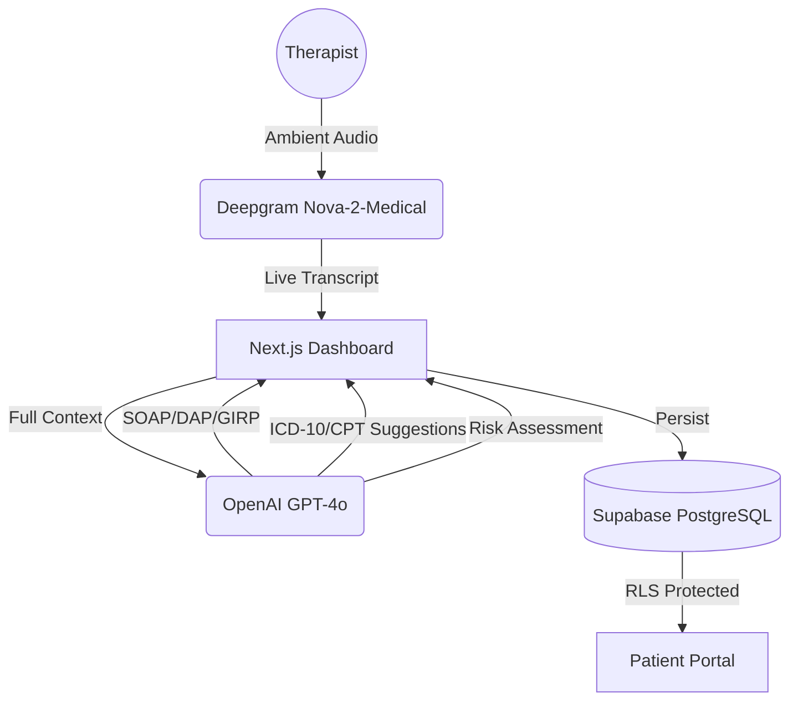

# Clinical Co-Pilot — Complete Project Walkthrough (CIOS)

**Clinical Co-Pilot** is an AI-powered **Clinical Intelligence Operating System (CIOS)** that transforms real-time patient-doctor conversations into structured medical records, financial claims, and longitudinal outcome data.

---

## 🏗️ Architecture Overview



### Data Flow
1. **Therapist clicks "Start Session"**: Audio streams to Deepgram (WebSocket).
2. **Real-time Diarization**: Speaker 0/1 identified and displayed in chat bubbles.
3. **Session Stop**: Full transcript + duration sent to GPT-4o.
4. **Multi-Format Synthesis**: AI generates SOAP, DAP, or GIRP notes plus Risk Score.
5. **Invisible Billing**: AI extracts symptoms to map ICD-10 codes and suggests CPT codes.
6. **Persistence**: Transcript, Notes, Billing, and Risk data saved with RLS protection.

---

## 🚀 Key Modules & UI Features

### 1. The Clinical Scribe (Ambient Dashboard)
- **LiveTranscript**: Chat-style interface with auto-scroll and speaker labels.
- **Intelligence Panel**: Dynamically switches between AI drafting and Entity extraction.
- **Note Formats**: User-selectable documentation styles (SOAP, DAP, GIRP).

### 2. Billing & Revenue Ops (Superbill Generator)
- **Automatic Coding**: Maps extracted symptoms to ICD-10 diagnosis codes.
- **Fee Management**: Auto-suggests CPT codes based on session minutes (e.g., 90834).
- **Billing History**: Tracks claim status (Draft, Ready for Payer, Finalized).

### 3. Outcome Intelligence (PHQ-9/GAD-7)
- **Integrated Assessments**: Direct clinical assessment gathering within the workflow.
- **Clinical Flywheel**: Uses assessment scores to enrich the clinical documentation.

### 4. Appointment Management
- **Inbox**: Real-time tracking of new appointment requests.
- **Lifecycle**: Pending → Scheduled → Completed transitions.

---

## 🛠️ Technical Stack

| Layer | Technology |
|-------|-----------|
| **Core Framework** | Next.js 15 (TypeScript, App Router) |
| **Styling** | TailwindCSS + Lucide Icons |
| **Speech-to-Text** | Deepgram (Medical Model) |
| **Intelligence Engine**| OpenAI GPT-4o (Structured Mode) |
| **Database/Auth** | Supabase (PostgreSQL, Auth, Storage) |
| **Middleware** | Edge-side Role Based Access Control (RBAC) |

---

## 📂 Project Structure

```text
clinical-copilot/
├── src/app/
│   ├── (auth)/             # Login/Signup/Role Selection
│   ├── doctor/             # Clinician Dashboards & Billing
│   ├── patient/            # Patient Portals
│   ├── session/            # Active Recording Interface
│   ├── actions.ts          # Centralized Server Actions
│   └── middleware.ts       # Route guards & Role routing
├── src/components/         # Reusable UI (Superbill, Recorder, NoteGenerator)
├── src/lib/                # prompts.ts, supabase-client.ts
└── supabase/               # SQL Schema & Migrations
```

---

## ✅ Validations & Security
- **HIPAA Readiness**: Row Level Security (RLS) ensures clinicians only see their own patients.
- **Risk Alert Engine**: Automatically catches "high" or "critical" risk factors in conversations.
- **Clinical Consistency**: Strict JSON mode for GPT-4o ensures valid data schemas.

---
*Generated on February 16, 2026*
